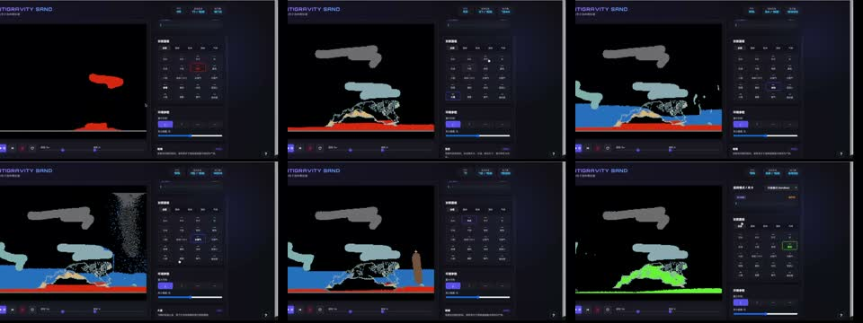

# LLM Sand Game Test

[中文](README.md)

One prompt, many model outputs. This repo keeps the code and videos from a falling-sand game test across different LLMs.

The task is short, but it still presses on requirement understanding, physics simulation, material systems, frontend engineering, interaction design, performance, self-checking, and constraint following. The generated results quickly show what each model is good at, what it misses, and where its mistakes may leak into real development work.

## Prompt

```text
完成一个基于用物理引擎和 HTML/CSS 的带材质系统的落沙模拟游戏
```

Single-HTML version:

```text
完成一个基于用物理引擎和 HTML/CSS 的带材质系统的落沙模拟游戏（单HTML）
```

## Videos

| Video | Note |
| --- | --- |
| [](media/compare.mp4) | Cut-together comparison video with timeline labels. The original was over GitHub's file limit, so this repo keeps a compressed copy. |
| [](media/gpt55.mp4) | GPT-5.5 standalone run. |
| [](media/gemini35-flash.mp4) | Gemini 3.5 Flash follow-up run. |

## Test Results

Code lives in [`results/`](results/).

It currently includes outputs from Codex/GPT, Claude Code, Antigravity/Gemini, Qwen, GLM, MiniMax, DeepSeek, and others. The generated folders are mostly left as-is; only `node_modules`, `.DS_Store`, and local tool config were removed.

Most samples run by opening their entry HTML file. Or start a static server:

```bash
python3 -m http.server 4173
```

Then open:

```text
http://localhost:4173/results/
```

## Note

This is not a leaderboard. It is a record of what happened under the same prompt. New model runs can be added later.

## License

MIT
