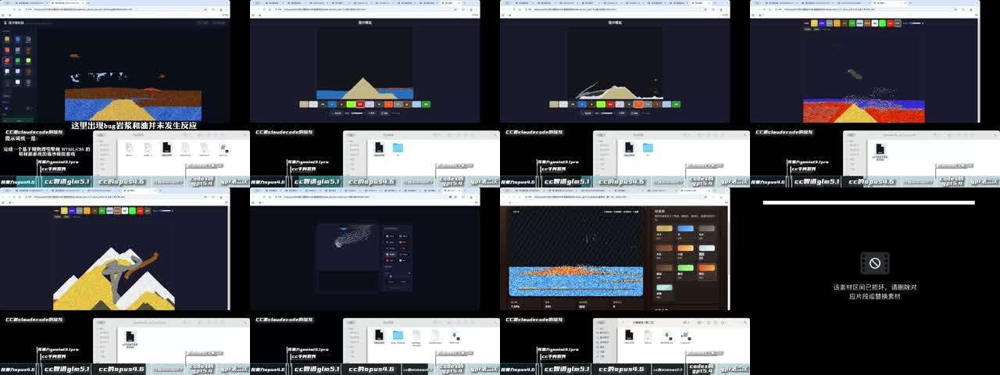
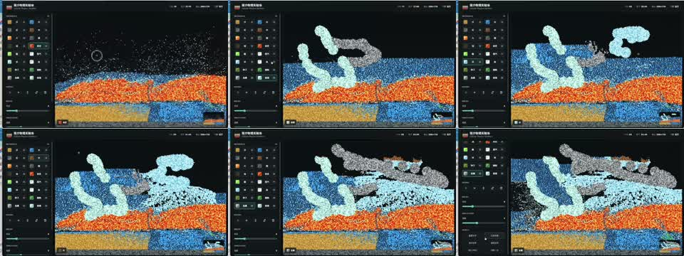

# One-Prompt HTML Game Benchmark

用一句很短的提示词，让不同模型生成一个“基于物理引擎和 HTML/CSS 的带材质系统的落沙模拟游戏”，并把结果代码与测试视频放在一起。

这个仓库不是严格跑分榜，也不是论文式评测。它更像一个真实生产实践里的小切片：需求很短，但里面同时压着需求理解、物理模拟、材质系统、前端工程、交互设计、性能、自测和约束遵循。模型生成出来的结果，会很快暴露它们各自擅长什么、忽略什么，以及在真实开发中可能会把问题带到哪里。

## Test Prompt

原始提示词只有一句话，没有额外规格书，也没有多轮提示词工程。

普通版本：

```text
完成一个基于用物理引擎和 HTML/CSS 的带材质系统的落沙模拟游戏
```

单文件约束版本：

```text
完成一个基于用物理引擎和 HTML/CSS 的带材质系统的落沙模拟游戏（单HTML）
```

## What This Tests

- 能不能把一句含糊但真实的需求拆成可运行的前端游戏。
- 是否真的实现了“物理”和“材质系统”，而不是只做静态 UI 或简单粒子效果。
- 沙、水、火、烟、油、岩浆、酸、木头等材质是否有可观察的交互规则。
- UI 是否能支撑测试：材质切换、画笔大小、清空、暂停、速度、状态反馈等。
- 工程组织是否合理：多文件项目是否清楚，单 HTML 版本是否真正自包含。
- 性能和稳定性：粒子数量上来后是否明显掉帧、卡死、错位或报错。
- 约束遵循：要求“单 HTML”时，是否仍然拆外部文件或依赖资源。

## Videos

点击缩略图可以打开对应视频。

| Video | Notes |
| --- | --- |
| [](media/one-prompt-html-game-model-comparison.mp4) | 测试合集，随手剪辑版，底部有进度条和模型标注。原始文件超过 GitHub 单文件限制，仓库内版本已压缩为 73MB。 |
| [](media/gpt-5.5-xhigh-html-game-test.mp4) | 单独测试 GPT-5.5 xhigh。 |
| [](media/gemini-3.5-flash-html-game-test.mp4) | 最新补测的 Gemini 3.5 Flash。 |

## Results

结果代码放在 [`results/`](results/) 目录中，基本保留当时模型输出的目录结构和文件名，只移除了不适合公开发布的本机工具配置与依赖缓存。

当前包含的样本大致覆盖：

- Codex / GPT-5.4 / GPT-5.5
- Claude Code / Claude Opus 4.6
- Antigravity / Gemini 3.1 Pro / Gemini 3.5 Flash
- Qwen 3 Max / Qwen 3.5 Plus
- GLM 5.1
- MiniMax 2.7
- DeepSeek V4 Pro

有些模型在同一提示下会生成完整多文件项目，有些会生成单文件 HTML，有些会偏向视觉效果，有些会偏向规则模拟。这里保留这些差异，而不是把结果统一重构成同一种风格。

## How To Inspect

多数结果可以直接打开对应的 `index.html`、`falling-sand.html` 或 `gpt.html` 查看。也可以在仓库根目录启动一个静态服务：

```bash
python3 -m http.server 4173
```

然后访问：

```text
http://localhost:4173/results/
```

## Notes

- 这个测试的价值在于“低提示词密度”：越少的说明，越容易看到模型默认工程直觉的差异。
- 新出的模型还没有全部补齐，后续可以继续用同一句 prompt 追加结果。
- 仓库里的结果是测试记录，不代表每个模型在充分提示、工具链完善、人工 review 后的最佳表现。

## License

MIT
